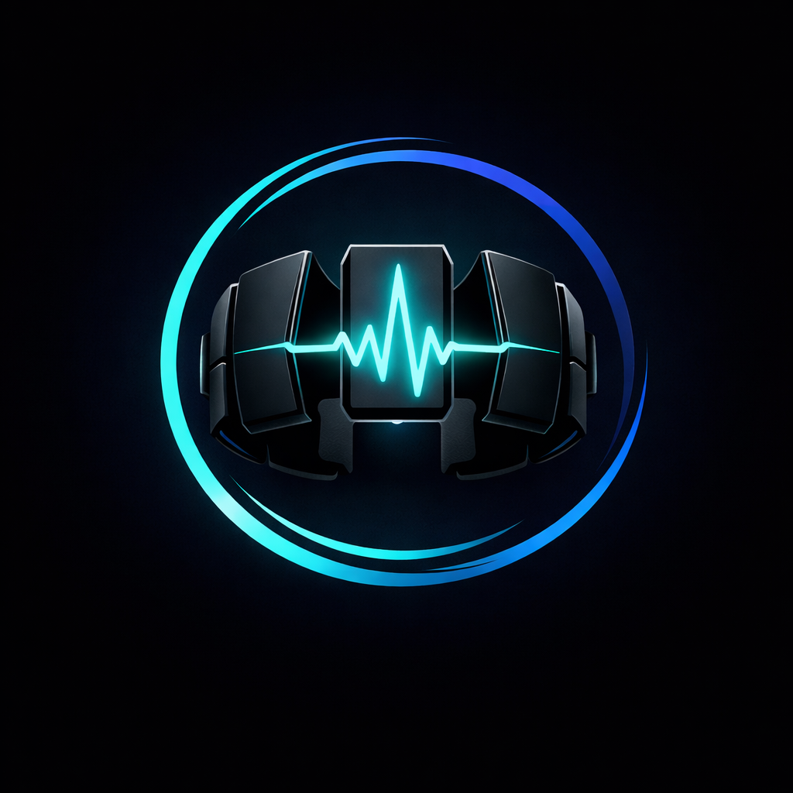
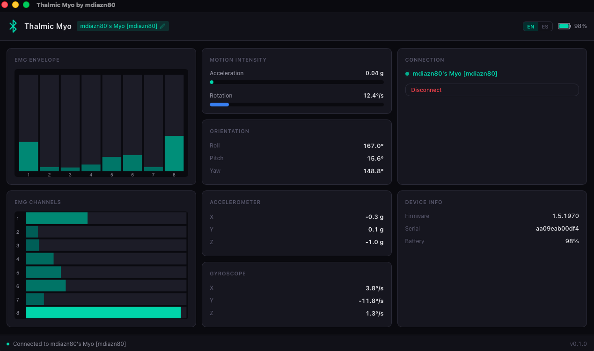

# Thalmic Myo by mdiazn80

<div align="center">
  
</div>

Desktop application for interfacing with the [Thalmic Myo](https://github.com/thalmiclabs/myo-bluetooth) armband via Bluetooth Low Energy. Replaces the discontinued official Myo software.

## Tech Stack

| Layer | Technology | Version |
|-------|-----------|---------|
| Framework | [Tauri](https://v2.tauri.app/) | 2 |
| Frontend | [React](https://react.dev/) + TypeScript | 19 |
| Build tool | [Vite](https://vite.dev/) | 7 |
| Backend | Rust | 2021 edition |
| BLE | [btleplug](https://github.com/deviceplug/btleplug) | 0.11 |
| Package manager | [pnpm](https://pnpm.io/) | - |
| Task runner | [go-task](https://taskfile.dev/) | 3 |

## Prerequisites

- [Node.js](https://nodejs.org/) (LTS)
- [pnpm](https://pnpm.io/)
- [Rust](https://rustup.rs/)
- [go-task](https://taskfile.dev/installation/)
- Tauri 2 system dependencies ([see platform guide](https://v2.tauri.app/start/prerequisites/))

## Getting Started

```bash
task install    # Install frontend and Rust dependencies
task dev        # Launch the app in development mode
```

## Dashboard



## Tasks

All tasks are defined in `Taskfile.yml` and run via [go-task](https://taskfile.dev/).

| Task | Description |
|------|-------------|
| `task install` | Install all dependencies (frontend + Rust) |
| `task dev` | Start the full Tauri app in development mode |
| `task dev:frontend` | Start only the Vite frontend dev server (port 1420) |
| `task build` | Production build (frontend + Rust) |
| `task build:frontend` | Build only the frontend |
| `task clean` | Remove all build artifacts and dependencies |
| `task clean:frontend` | Remove frontend build artifacts and node_modules |
| `task clean:rust` | Remove Rust build artifacts (`cargo clean`) |

### Rust-specific

```bash
cd src-tauri && cargo check    # Type-check Rust code
cd src-tauri && cargo test     # Run Rust tests
```

## Project Structure

```bash
src/                          # React frontend
  App.tsx                     # Main state and layout
  App.css                     # All styles (CSS custom properties, BEM)
  i18n/                       # Internationalization (EN/ES)
  hooks/useMyoStream.ts       # BLE data stream hook
  services/ble.ts             # Tauri IPC bindings
  components/
    Header.tsx
    StatusBar.tsx
    Dashboard.tsx             # 3-column CSS grid
    dashboard/                # Dashboard panel components
      EmgPanel.tsx            # EMG channels (canvas)
      EmgEnvelopePanel.tsx    # EMG envelope RMS (canvas)
      OrientationPanel.tsx    # Roll/Pitch/Yaw from quaternion
      AccelerometerPanel.tsx  # X/Y/Z in g
      GyroscopePanel.tsx      # X/Y/Z in deg/s
      MotionIntensityPanel.tsx
      ConnectionPanel.tsx     # Scan/connect/disconnect
      DeviceInfoPanel.tsx

src-tauri/                    # Rust backend
  src/
    lib.rs                    # Tauri setup and plugin registration
    ble/
      mod.rs
      myo_protocol.rs         # BLE UUIDs and packet parsers
      manager.rs              # Scan, connect, disconnect
      commands.rs              # Tauri command handlers
      streaming.rs             # High-frequency data streaming
      device_info.rs           # One-shot device reads
```

## macOS Bluetooth

The app requires Bluetooth permission. During development, grant Bluetooth access to your terminal app in **System Settings > Privacy & Security > Bluetooth**.

## License

Licensed under the [Apache License 2.0](./LICENSE).
